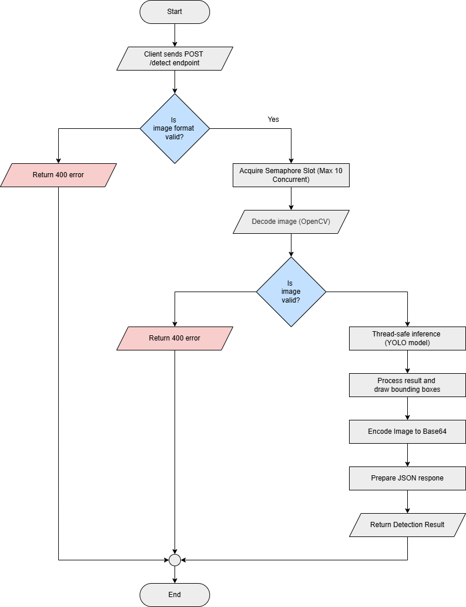

# Asset-Discrepancy-NMSAI

Asset-Discrepancy-NMSAI is a production-ready AI microservice for automated telecom asset detection from images. The service processes image input, performs object detection using a YOLO-based model, and returns structured detection results along with an annotated image.

This system is designed for controlled CPU environments and containerized deployments, with built-in safeguards to ensure stable operation under concurrent load.

---

## Overview

Asset-Discrepancy-NMSAI provides an HTTP API that:

1. Accepts an uploaded image (JPEG or PNG).
2. Decodes the image using OpenCV.
3. Performs thread-safe YOLO inference.
4. Detects telecom infrastructure assets.
5. Returns structured detection results.
6. Generates an annotated image with bounding boxes.
7. Returns the annotated image encoded as Base64.

The service is built with FastAPI and designed for scalable backend deployment.

---

## Key Features

- Production-grade FastAPI service
- Global YOLO model loading at startup
- Automatic model download from GitHub Release
- Thread-safe inference using locking mechanism
- Concurrent request control using semaphore
- Annotated image returned as Base64
- Color-coded bounding boxes for each asset class
- Dockerized deployment configuration
- Headless OpenCV optimized for server environments


## System Architecture




## Model Distribution

The production model is distributed via GitHub Release.

Version: `v1.2.0`  
Model File: `asset-11l-cp03-180.pt`

The application automatically downloads the model at startup if it is not present locally.

---

## Configuration

Core configuration parameters are defined in the service code.

### Model Configuration

```python
MODEL_PATH = "asset-11l-cp03-180.pt"

MODEL_URL = "https://github.com/mirteldisa01/Asset-Discrepancy-NMSAI/releases/download/v1.2.0/asset-11l-cp03-180.pt"
```

### Concurrency Control

```python
model_lock = threading.Lock()
batch_semaphore = threading.Semaphore(10)
```

Concurrency behavior:

- A maximum of **10 concurrent requests** are allowed.
- YOLO inference is protected using a **global thread lock** to avoid race conditions.
- Additional requests wait in queue until a slot becomes available.

This design prevents CPU overload and ensures stable inference behavior.

---

## Supported Detection Classes

The service detects telecom infrastructure assets and normalizes class names using a mapping layer.

### Class Mapping

| Model Class    | API Output     |
| -------------- | -------------- |
| rru            | RRU            |
| panel_antenna  | Panel_Antenna  |
| microwave_dish | Microwave_Dish |

### Bounding Box Colors

| Class          | Color (BGR) |
| -------------- | ----------- |
| Panel_Antenna  | Dark Red    |
| RRU            | Purple      |
| Microwave_Dish | Dark Green  |

Each detection is visualized with a colored bounding box and labeled confidence score.

---

## API Specification

### Endpoint

POST `/detect`

### Request

Multipart form-data:

```
file: image file (jpeg/png/jpg)
```

Supported formats:

- image/jpeg
- image/png
- image/jpg

### Response Example

```json
{
  "total_objects": 3,
  "counts": {
    "RRU": 1,
    "Panel_Antenna": 1,
    "Microwave_Dish": 1
  },
  "detections": [
    {
      "class": "RRU",
      "confidence": 0.92,
      "bbox": [120, 85, 260, 310]
    },
    {
      "class": "Panel_Antenna",
      "confidence": 0.88,
      "bbox": [420, 90, 520, 350]
    }
  ],
  "image_base64": "..."
}
```

Response fields:

- `total_objects` — total number of detected assets
- `counts` — object counts per class
- `detections` — list of detection results
- `image_base64` — annotated image encoded in Base64

---

## Thread Safety Strategy

To ensure safe concurrent execution, the system enforces two mechanisms.

### 1. Concurrency Limiter

```python
batch_semaphore = threading.Semaphore(10)
```

Limits the system to **10 concurrent processing requests**.

### 2. Thread-Safe Model Inference

```python
model_lock = threading.Lock()
```

Ensures only **one inference operation** runs at a time to avoid race conditions inside the YOLO model.

This architecture prevents memory conflicts and improves stability under load.

---

## Project Structure

```
asset-discrepancy-nmsai/
│
├── app/
│   ├── main.py
│   ├── model.py
│   └── utils.py
│
├── Dockerfile
├── docker-compose.yml
├── requirements.txt
├── .dockerignore
└── README.md
```

---

## Docker Deployment

### Build Image

```bash
docker build -t asset-discrepancy-nmsai .
```

### Run Container

```bash
docker run -p 8002:8000 asset-discrepancy-nmsai
```

Service will be available at:

```
http://localhost:8002/detect
```

---

## Docker Compose Deployment

### Start Service

```bash
docker-compose up -d
```

Service will run on:

```
http://localhost:8002
```

---

## Health Check

### Endpoint

```
GET /health
```

### Response

```json
{
  "status": "ok"
}
```

This endpoint can be used for container orchestration health monitoring.

---

## Technology Stack

- FastAPI
- Uvicorn
- Gunicorn
- Ultralytics YOLO
- PyTorch
- OpenCV (headless)
- NumPy
- Docker

---

## Production Considerations

- Designed primarily for CPU-based deployments.
- Model loaded once at startup to avoid repeated memory allocation.
- Semaphore-based concurrency control prevents overload.
- Thread locking prevents race conditions during inference.
- Suitable for VPS deployments and container orchestration.
- Can be extended to support GPU acceleration.

---

## Versioning

### v1.0.0  
Initial production release of the Asset Detection API including:

- Thread-safe inference pipeline
- Automatic model download
- Annotated image generation
- Dockerized deployment

Initial production release including core inference pipeline and model distribution.

### v1.2.0
- Updated YOLO production model
- Refined per-class detection logic and filtering rules
- Added startup model initialization and auto-download behavior
- Improved inference consistency and deployment readiness

---

## License

Copyright (c) 2026 Eldisja Hadasa

All rights reserved.

This software and associated documentation files (the "Software") are proprietary and confidential.

No part of this Software may be copied, modified, distributed, sublicensed, or used for commercial purposes without explicit written permission from the copyright holder.

Unauthorized use, reproduction, or distribution of this software is strictly prohibited.

---

## Maintainer

**Eldisja Hadasa**

The **Asset-Discrepancy-NMSAI** project implements a containerized AI inference service for detecting and analyzing discrepancies between expected and actual assets in visual data, using FastAPI and YOLO, designed for CPU-efficient concurrent deployment with Docker and Gunicorn workers.


- GitHub: https://github.com/mirteldisa01
